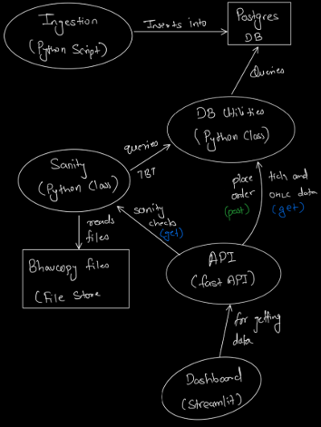

# System Architecture
The system architecture consists of the following components:
- **Ingestion Pipeline**: Pipeline for ingesting the data
- **Database**: Postgres DB was selected for its quick and easy deployment using docker
- **DB Utilities**: Framework for creating database connections, individual class with same method signatures based components for easily switching between different datatypes
- **API**: FastAPI based API framework easily accessing data, checking sanity results and sending orders
- **Sanity Module**: A python class for running EOD comparison checks between the bhavcopy files and the tbt data
- **Dashboard**: A simple and functional streamlit app for accessing the API end points

Below is a simple Flow Diagram for how each of these above components interact with each other

> 

---

# Pipeline Workflow

> ## The Ingestion Module:
We have a database which stores our TBT data, the ingestion pipeline `ingester.py` is triggered and the date for which the data is required is passed on to the script in the format `YYYY-MM-DD`. If the date is not as expected or absent it will exit with a message for the expected errors (ValueError for invalid date format and TypeError for incorrect data types). 

After these preliminary checks have been cleared an object of the `Ingester` class is created and the method of `ingest_tbt_data` is called with the date taken as input passed for ingestion. The ingester class expects the data to be present at a fixed location and follows a fixed convention for the file name, based on this the data is read from the zip files and inserted to the database via the DB utility (in our case utility for the postgres database i.e. PGUtils).

> ## The Postgres Utility:
The PGUtils implements the DBInterface interface, which requires three methods to be implemented 
1.	`_create_tbt_table`: Method to create the TBT Table, this could follow certain rules for different databases and hence is required to be implemented
2.	`insert_df_to_tbt`: Method for inserting the dataframe into the database
3.	`get_tick_data`: Method to query the tick data from the database

Each of these methods are required along with any additional methods the user sees fit, these constraints allows us to seamlessly switch between databases without breaking any dependencies while giving us the ability to scale with ease. The `PGUtils` class used in our systems implements another method for querying the OHLCV data along with several other utility methods for convenience and modularity between the class methods as well.

> ## The Sanity Section:
The sanity section of the process compares the tick data with the bhavcopy data, the data for the bhavcopy is also expected to be in a fixed location and is expected to follow a fixed format, the bhavcopy file is read by the sanity script along with the OHLCV data being procured from the TBT database, once both the data is available they are compared and the values having differences are returned. The rules for comparison or highlighting that the data is sane are as follows.

For each symbol everyday:
1.	The total traded volume/quantity for the day is same in bhavcopy and the recorded data, i.e. `volume_bhav == volume_ohlcv`
2.	The highest price of the bhavcopy is greater or equal to the highest price of the data i.e. `high_bhav >= high_ohlcv`
3.	The lowest price of the bhavcopy is less or equal to the lowest price of the day i.e. `low_bhav <= low_ohlcv`

Lastly, the unique symbols in the bhavcopy and the ohlcv dataframe are the same, if not some symbol is missing. These results are then returned in the form of a dictionary.

> ## The API:
The API endpoint is where everything comes together under 4 different API calls, these calls are:
1.	`/ticks` (GET Request): 
This defines a FastAPI endpoint (`/ticks`) that fetches tick data for a given symbol and date range, and returns it as a streaming CSV response. The `stream_ticks` function is called to generate the tick data, which is then wrapped in a `StreamingResponse` object with a media type of `text/csv`.

2.	`/ohlcv` (GET Request):
This defines a FastAPI endpoint (`/ohlcv`) that fetches and streams OHLCV (Open, High, Low, Close, Volume) data for a given stock symbol and date range. The data is returned as a CSV-formatted generator, with each candle (bar) (i.e., a data point) yielded as a comma-separated string.

3.	`/place-order` (PUT Request):
This defines a POST endpoint `/place-order` that accepts an `OrderMsg`(symbol, price and quantity) object, extracts the symbol, price, and quantity, and appends the order details to a list `PLACED_ORDERS`. It then returns a dictionary containing a success message and the updated list of placed orders.

4.	`/quality-checks` (GET Request):
This defines a FastAPI endpoint (`/quality-checks`) that accepts a date string (`tdate`) and returns a dictionary containing the results of quality checks on the bhavcopy data for that date. The actual quality checks are performed by the `run_bhav_checks` function, which is implemented in the `bhavcopy.py` file in the sanity section.

The API interface is built using the FastAPI as it is reliable and significantly stable with easy to integrate with a lot of other tools and packages

> ## The Dashboard:
The dashboard is built using streamlit package in python as it is fairly intuitive it work with and gives you quite enough customization and functionalities to quickly get up and running.

The dashboard has four sections like the four API endpoints (one section for each), and it allows you to access and explore the usecase of API with ease and a simple yet intuitive UI.